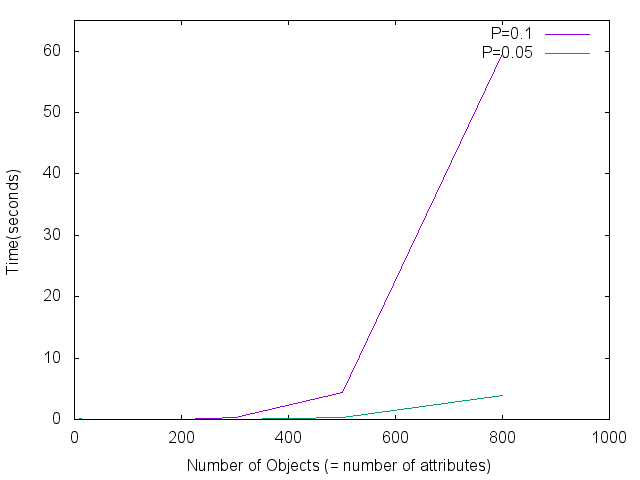

## fca-rust

Implementations of algorithms in formal concept analysis.

## Status

* [x] Sequential Concept Enumerator \*1

* [ ] Parallel Concept Enumerator \*1

* [ ] MapReduce Concept Enumerator \*2

\*1 Parallel Recursive Algorithm for FCA, Petr Krajca, Jan Outrata and Vilem Vychodil, *The International Conference on Concept Lattices and Their Applications*, 2008.

\*2 Distributed Formal Concept Analysis Algorithms Based on an Iterative MapReduce Framework, Biao Xu, Ruairıde Frein, Eric Robson, and Mıcheal ́O Foghlu, *International Conference on Formal Concept Analysis*, 2012.


## How to use

Firstly, clone the repo:

```bash
git clone https://github.com/zhaihj/fca-rust
```

Build the project with `cargo`:

```bash
cargo build --release
```

Then you will get two executable files in `./target/release/`. Give it a try:

Generate a random relation sheet with 500 object, 500 attributes and P at 0.1:

```bash
./target/release/generate_random_fca 500 500 0.1 > 500_500_0.1.fc
```

Enumerate all concepts:

```bash
time ./target/release/generate_concept 500_500_0.1.fc
```

You will get: 

```bash
Loading data..
Reading data..
Enumerating..
433913 concepts generated.
./target/release/generate_concept 500_500_0.1.fc  4.38s user 0.03s system 99% cpu 4.404 total
```

To see all the enumerated concepts, use `-v` option:

```bash
$ ./target/release/generate_random_fca 15 5 0.3 > 15_5_0.3.fc
$ ./target/release/generate_concept 15_5_0.3.fc -v
Loading data..
Reading data..
Enumerating..
11 concepts generated.
[intends: [0, 1, 4, ], extends: [14, ] ]
[intends: [1, 2, 4, ], extends: [9, 11, ] ]
[intends: [1, 4, ], extends: [9, 11, 14, ] ]
[intends: [1, ], extends: [7, 9, 11, 14, ] ]
[intends: [2, 3, ], extends: [12, ] ]
[intends: [2, ], extends: [9, 11, 12, ] ]
[intends: [3, 4, ], extends: [4, 8, ] ]
[intends: [3, ], extends: [0, 4, 8, 12, 13, ] ]
[intends: [4, ], extends: [4, 5, 8, 9, 10, 11, 14, ] ]
[intends: [], extends: [0, 1, 2, 3, 4, 5, 6, 7, 8, 9, 10, 11, 12, 13, 14, ] ]
[intends: [0, 1, 2, 3, 4, ], extends: [] ]
```

## Performance

Test on the random data generated by `generate_random_fca`:



## License

MIT
